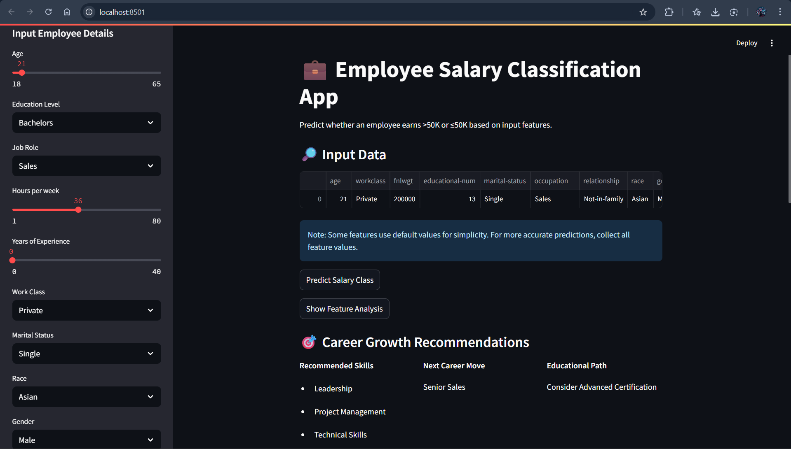
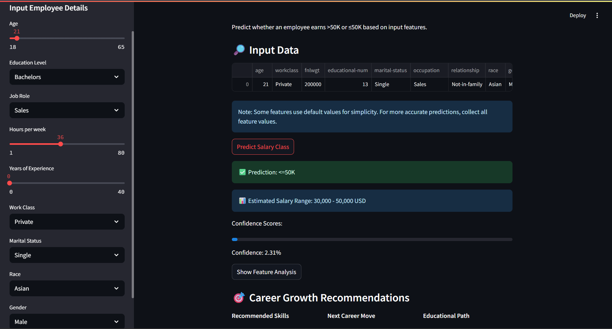
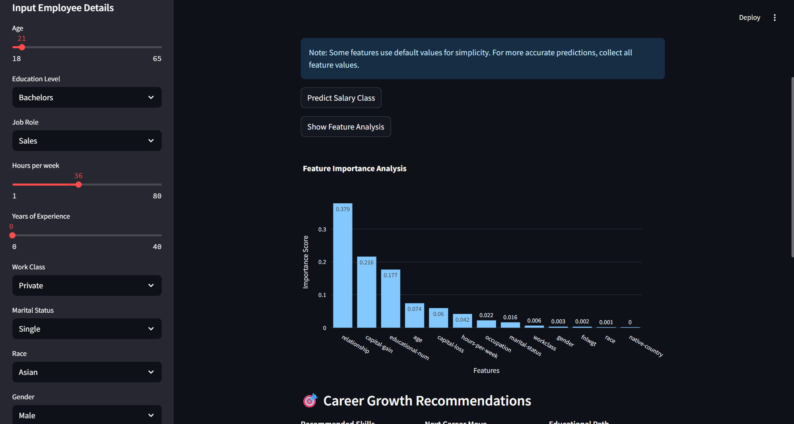
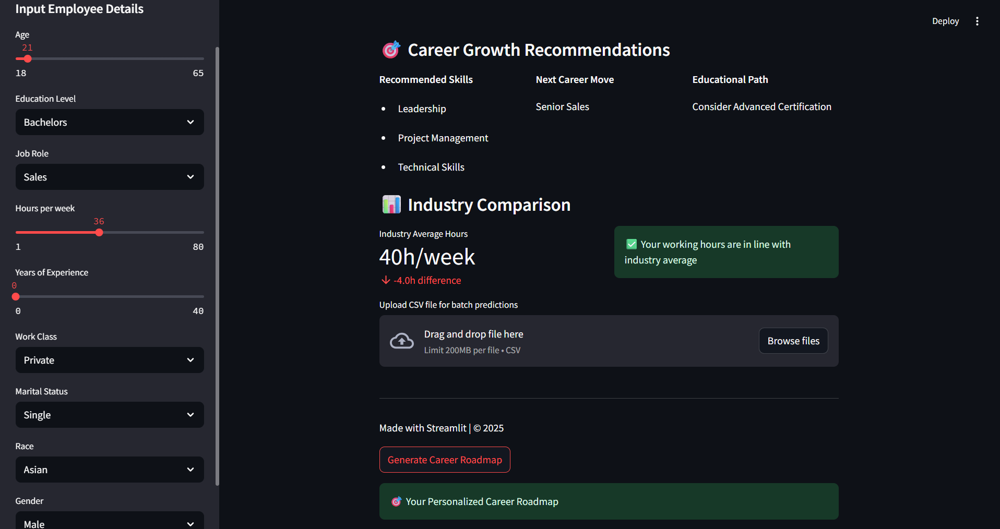
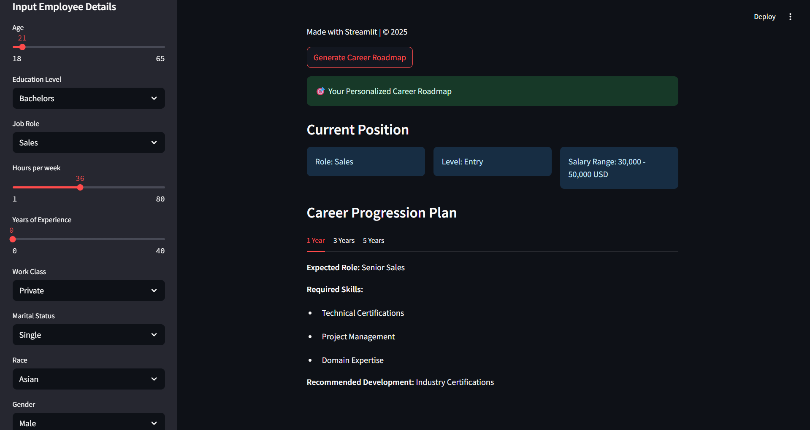

# Employee Salary Classification App 💼

A Streamlit web application that predicts employee salary classes (>50K or ≤50K) using machine learning. Includes career recommendations, industry comparisons, and personalized career roadmaps.

 







 


## Features ✨

- **Salary Prediction**: Predicts salary class based on 13 demographic and employment features
- **Career Recommendations**: Provides personalized career growth advice
- **Industry Comparison**: Compares work hours against industry averages
- **Feature Analysis**: Visualizes importance of different model features
- **Career Roadmap**: Generates personalized 5-year career progression plan
- **Batch Processing**: Upload CSV files for bulk predictions

## Requirements 📋

- Python 3.8+
- Streamlit
- Scikit-learn
- Pandas
- NumPy
- Plotly
- Joblib

## Installation 🚀

1. Clone the repository:
```
git clone https://github.com/your-username/employee-salary-classifier.git
cd employee-salary-classifier
```
2. Install dependencies:
```
pip install -r requirements.txt
```
3. Download the trained model:
```
best_model.pkl
```
4. Run the application:
```
streamlit run app.py
```

## Usage Guide 📖

1. Input employee details in the sidebar
2. Click "Predict Salary Class" to see prediction results
3. Explore career recommendations and industry comparisons
4. Generate personalized career roadmaps
5. Use "Upload CSV" for batch predictions

## File Structure 🗂️

```
employee-salary-classifier/
|-- app.py                 # Main application script
|-- best_model.pkl         # Trained ML model
|-- requirements.txt       # Python dependencies
|-- README.md              # Project documentation
`-- images/
    |--ss1.png
    |--ss2.png
    |--ss3.png
    |--ss4.png
    `--ss5.png
```

## Customization ⚙️

To use with your own model:
1. Train your model using Scikit-learn
2. Save with `joblib.dump(model, "best_model.pkl")`
3. Update expected_features in `app.py` to match your feature set

## Contributing 🤝

Contributions are welcome! Please open an issue or submit a pull request for any improvements.

## License 📄

This project is licensed under the MIT License - see the [LICENSE](LICENSE) file for details.
